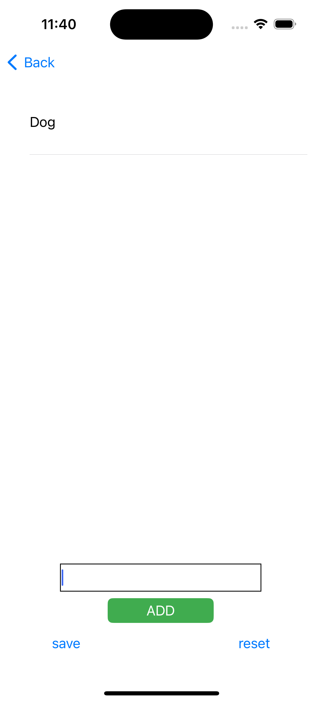
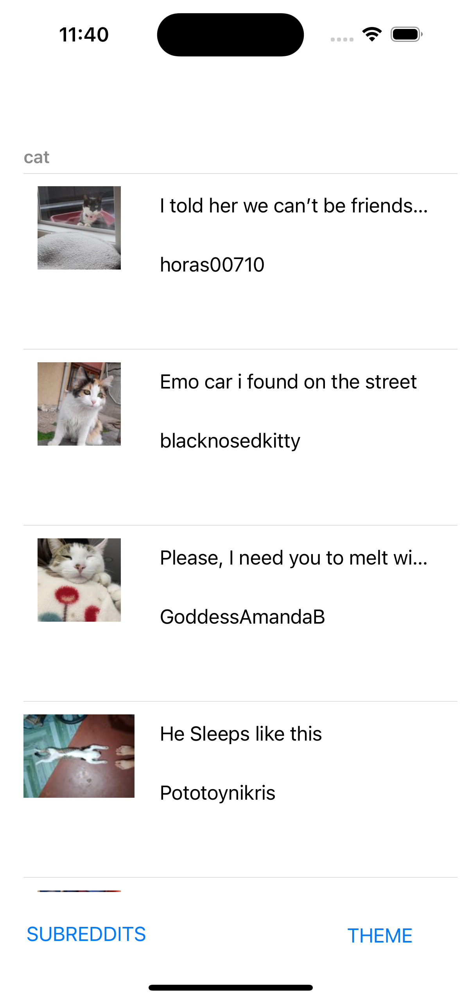
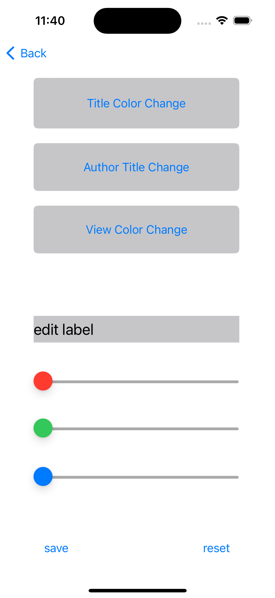

# RedditPostViewer-iOS

An iOS Reddit client built in Swift using UIKit. This app fetches subreddit post data using Reddit’s public JSON API, displays content in a sectioned table view, and lets users customize the UI with RGB color sliders. User preferences like subreddit choices and color themes are saved locally using `UserDefaults`.

---

## Features

- Browse posts from any subreddit
- Customize the app’s theme (title, author, background color)
- Save subreddit preferences and UI themes using `UserDefaults`
- Tap any post to view it in Safari
- Sectioned table view layout grouped by subreddit

---

## Built With

- Swift 5
- UIKit
- JSONSerialization
- UserDefaults
- URLSession
- Xcode Interface Builder

---

## Screenshots

### Subreddit List

### Post Viewer

### Theme Customizer

---

## Project Structure

- `ViewController.swift` – Main Reddit post display
- `Post.swift` – Model for decoding Reddit JSON
- `ThemeViewController.swift` – RGB slider color customization
- `SubRedditViewController.swift` – Add/remove favorite subreddits
- `userDefaults.swift` – Custom `UserDefaults` extensions for saving data

---

## Getting Started

1. Clone the repo or download ZIP  
2. Open `MeyerSarahCE08.xcodeproj` in Xcode  
3. Build and run on a simulator or device  
4. Add your favorite subreddits and customize your theme

---

## Author

**Sarah Meyer**  
Originally built for CE08 at Full Sail University  
Updated in 2025 for professional portfolio use

---

## Notes

- This project uses manual JSON parsing instead of `Codable` to demonstrate lower-level handling
- Thumbnail images are loaded synchronously for simplicity
